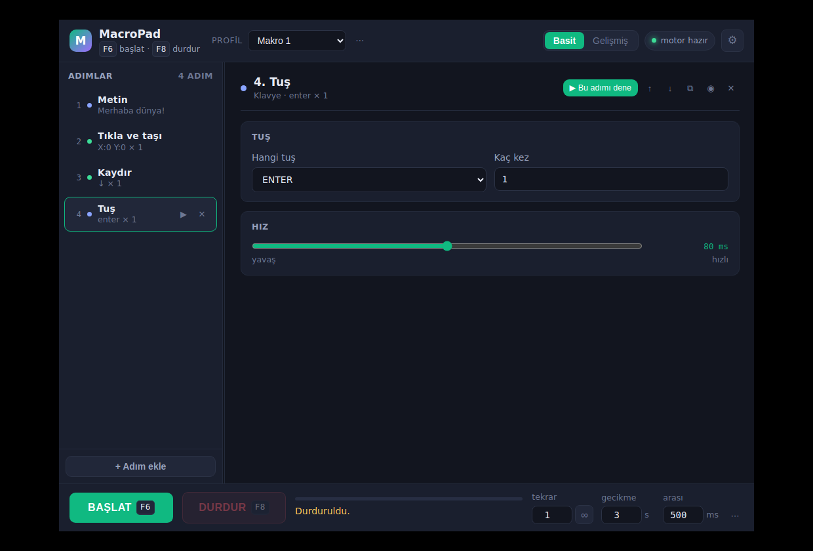
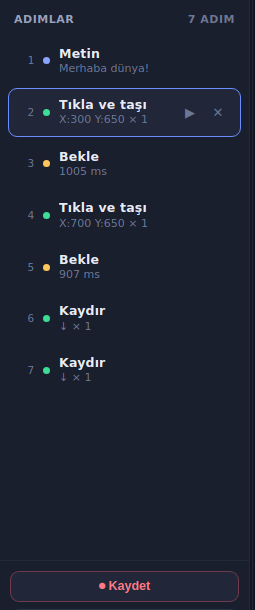
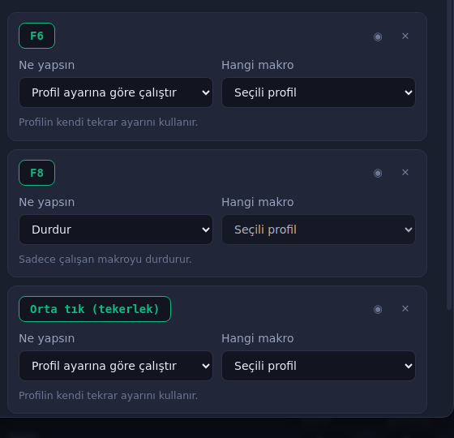

<div align="center">


# MacroPad

**Keyboard & mouse macro automation for Windows.**
Electron interface, Python engine. Free and open source.

[Türkçe](#türkçe) · [Features](#features) · [Install](#install) · [Build](#build-your-own-exe) · [How it works](#how-it-works)



</div>

---

## Features

- **Step-based macros** — text typing, mouse clicks, key presses, key combinations, waits, scrolling, mouse movement. Steps run top to bottom and can be reordered by drag and drop.
- **Recording** — press record, do the thing, press `F10`. Your clicks (with coordinates), keys, scrolls and the pauses between them become steps automatically.
- **Piano mode** — plays virtual-piano note sheets. Bracketed chords like `[sjf]` are really pressed together, capital letters hit black keys.
- **Flexible shortcuts** — bind as many as you like to keys *or* mouse buttons (middle, side buttons). Each one gets its own behaviour: run once, use the profile's repeat count, toggle on/off, run while held down, stop, or queue another run. Each can target a specific profile.
- **Profiles** — keep separate macro sets, each with its own run settings and target window. Save and load as `.json`.
- **Target window** — pick from your open windows; the macro brings it to the front before starting, so the first click isn't spent activating it.
- **Simple / Advanced modes** — Simple shows one speed slider per step; Advanced exposes every millisecond.
- **Bilingual** — English and Turkish, detected from your system language.
- **Light and dark themes**, five accent colours, three text sizes, ms/seconds toggle.

<div align="center">


</div>

## Install

**Users:** grab `MacroPad-Tasinabilir-x.y.z.exe` from [Releases](../../releases) and double-click it. Nothing else is needed — Python and Node are bundled inside.

**From source:** double-click **`BASLAT.bat`**. On first run it installs whatever is missing (Python, Node.js, `pynput`, Electron packages), adds a desktop shortcut and starts the app. Later runs start immediately.

## Build your own exe

Double-click **`EXE-OLUSTUR.bat`**. It finds a Python that PyInstaller supports, compiles the engine into a single exe, verifies it actually starts, then packages everything with electron-builder. Output lands in `uygulama/dist/`:

| File | What it is |
|---|---|
| `MacroPad-Tasinabilir-x.y.z.exe` | Portable, single file, no installation |
| `MacroPad-Kurulum-x.y.z.exe` | Classic installer |

Pushing a `v*` tag also builds both on GitHub Actions and attaches them to the release.

## How it works

```
┌──────────────────────────┐        JSON over stdin/stdout        ┌────────────────────────┐
│  Electron  (interface)   │ ─────────────────────────────────►   │  Python  (engine)      │
│  renderer/ + main.js     │ ◄─────────────────────────────────   │  engine/engine.py      │
└──────────────────────────┘   commands / events, line by line    └────────────────────────┘
                                                                    pynput + Win32 SendInput
```

The interface never touches the keyboard or mouse itself; it sends commands like `start`, `record_start`, `bindings` and receives events like `ready`, `progress`, `trigger`, `rec`. Input goes out through `SendInput` on Windows (real move + button events, so applications actually see the click) and falls back to pynput elsewhere.

```
MacroPad/
├── BASLAT.bat            start the app (installs what's missing on first run)
├── EXE-OLUSTUR.bat       build the Windows package
├── KULLANIM.md           full guide (Turkish)
└── uygulama/
    ├── main.js           Electron main: window, spawns the engine, IPC bridge
    ├── preload.js        secure bridge
    ├── renderer/         interface (app.js, style.css, index.html, i18n.js)
    ├── engine/engine.py  the engine — keyboard, mouse, recording, shortcuts
    └── araclar/          diagnostics
```

Adding a new action means one entry in the action catalogue, one handler in the engine and two translation keys — the interface builds itself from there.

## Notes

- Applications running **as administrator** ignore synthetic input from normal processes. Run MacroPad as administrator too if your target is elevated.
- Some games read raw input directly and will not see simulated input at all.
- Antivirus software sometimes flags PyInstaller executables that simulate input. That is expected for this kind of tool.

## License

MIT — see [LICENSE](LICENSE).

---

<a name="türkçe"></a>

## Türkçe

MacroPad, Windows için klavye ve fare makrosu uygulamasıdır. Arayüzü Electron, motoru Python.

- **Adım tabanlı makrolar** — metin yazdırma, tık, tuş, kombinasyon, bekleme, kaydırma, fare taşıma. Adımlar sürükle-bırak ile sıralanır.
- **Kayıt** — kaydı başlat, işi yap, `F10`. Tıkladığın koordinatlar, bastığın tuşlar ve aradaki beklemeler kendiliğinden adıma dönüşür.
- **Piyano modu** — sanal piyano nota sayfalarını çalar, `[sjf]` gibi akorlar gerçekten aynı anda basılır.
- **Esnek kısayollar** — tuş ya da fare düğmesi; bir kez çalıştır, aç/kapa, basılı tuttukça, durdur, sıraya ekle. Her kısayol farklı bir profili hedefleyebilir.
- **Profiller**, **hedef pencere**, **basit/gelişmiş mod**, **açık/koyu tema**, **Türkçe/İngilizce**.

Kurulum ve kullanımın tamamı için **[KULLANIM.md](KULLANIM.md)** dosyasına bak.

Hazır sürümü [Releases](../../releases) bölümünden indirebilir, kaynaktan çalıştırmak için `BASLAT.bat` dosyasına çift tıklayabilirsin.
